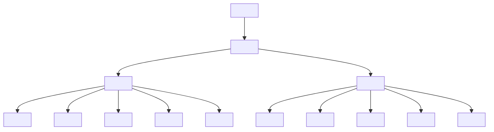

# Module HTML — Complet et Opérationnel

> [!note]
> **Objectif** : Maîtriser **100% des fondamentaux HTML** pour concevoir des pages web **sémantiques, accessibles, performantes** et prêtes pour la production.
>
> **À la fin de ce module, vous saurez :**
> - Structurer correctement un document HTML (`doctype`, `html`, `head`, `body`).
> - Utiliser les **balises sémantiques** (structure, contenu, navigation, formulaires, médias).
> - Intégrer **liens, images, vidéos, audio, tableaux, listes** et **formulaires**.
> - Appliquer les **bonnes pratiques d’accessibilité (a11y)** et de **SEO**.
> - Améliorer la **performance** (ressource hints, lazy-loading, dimensions, CLS).
> - Valider votre HTML et déboguer les erreurs courantes.

---

## Table des matières

- [1. Qu’est-ce que HTML ?](#1-quest-ce-que-html)
- [2. Anatomie d’un document HTML](#2-anatomie-dun-document-html)
- [3. Sémantique et structure du contenu](#3-semantique-et-structure-du-contenu)
- [4. Liens et navigation](#4-liens-et-navigation)
- [5. Médias : images, SVG, audio, vidéo](#5-medias-images-svg-audio-video)
- [6. Listes et tableaux](#6-listes-et-tableaux)
- [7. Formulaires (complet)](#7-formulaires-complet)
- [8. Accessibilité (a11y)](#8-accessibilite-a11y)
- [9. Internationalisation (i18n)](#9-internationalisation-i18n)
- [10. SEO de base](#10-seo-de-base)
- [11. Performance front-end côté HTML](#11-performance-front-end-cote-html)
- [12. Sécurité côté HTML](#12-securite-cote-html)
- [13. Progressive Enhancement & Fallback](#13-progressive-enhancement--fallback)
- [14. Validation & Qualité](#14-validation--qualite)
- [15. Organisation des fichiers & chemins](#15-organisation-des-fichiers--chemins)
- [16. Exercices guidés avec corrections](#16-exercices-guides-avec-corrections)
- [17. Checklist de référence](#17-checklist-de-reference)
- [18. Glossaire rapide](#18-glossaire-rapide)
- [19. FAQ](#19-faq)
- [20. Références & ressources](#20-references--ressources)

---

## 1. Qu’est-ce que HTML ?

**HTML (HyperText Markup Language)** est le **langage de balisage** qui décrit la **structure** et la **signification** du contenu d’une page web. Il n’est **pas** un langage de programmation ; il définit **quoi** et **quel rôle** joue chaque morceau de contenu.

- **HyperText** : réseau de documents reliés par des **liens**.
- **Markup** : balises (tags) annotant le contenu (ex. `<p>`, `<a>`).
- **Langage** : norme définie (HTML Living Standard).

> [!tip]
> **HTML = Structure**, **CSS = Présentation**, **JavaScript = Comportement**.

**Analogie maison** : 
- HTML = murs et pièces (structure).
- CSS = déco et style.
- JS = électricité et interactions.

---

## 2. Anatomie d’un document HTML

### 2.1. Squelette minimal requis

```html
<!DOCTYPE html>
<html lang="fr">
  <head>
    <meta charset="utf-8">
    <meta name="viewport" content="width=device-width, initial-scale=1">
    <title>Titre de la page</title>
  </head>
  <body>
    <!-- Contenu visible -->
  </body>
</html>
```

**Explications :**
- `<!DOCTYPE html>` : active le mode **standards** du navigateur.
- `<html lang="fr">` : racine du document ; `lang` facilite l’accessibilité, la synthèse vocale et le SEO.
- `<meta charset="utf-8">` : encodage universel des caractères.
- `<meta name="viewport" content="width=device-width, initial-scale=1">` : responsive de base.
- `<title>` : titre affiché dans l’onglet et crucial pour le SEO.

### 2.2. Éléments clés du `<head>`

- **`<meta name="description">`** : résumé court (150–160 caractères) pour les SERP.
- **`<link rel="icon" href="/favicon.ico">`** : icône de l’onglet.
- **`<link rel="manifest" href="/site.webmanifest">`** : PWA (icônes, nom, couleurs).
- **`<link rel="canonical" href="https://exemple.com/page">`** : URL canonique pour éviter le contenu dupliqué.
- **Ressource hints** :
  ```html
  <link rel="preconnect" href="https://cdn.exemple.com" crossorigin>
  <link rel="dns-prefetch" href="//cdn.exemple.com">
  <link rel="preload" href="/fonts/inter.woff2" as="font" type="font/woff2" crossorigin>
  ```
- **Open Graph / Twitter Cards** (aperçus sociaux) :
  ```html
  <meta property="og:title" content="Titre">
  <meta property="og:description" content="Description">
  <meta property="og:image" content="https://exemple.com/og.jpg">
  <meta property="og:url" content="https://exemple.com/page">
  <meta name="twitter:card" content="summary_large_image">
  ```
- **`<base href="https://exemple.com/">`** (optionnel) : base pour les URLs relatives (attention aux effets de bord).

> [!warning]
> **Évitez** de surcharger le `<head>`. Chargez **seulement** ce qui est nécessaire. Mesurez l’impact (poids, requêtes, ordre de chargement).

### 2.3. Diagramme de structure (mermaid)



---

## 3. Sémantique et structure du contenu

**But** : donner une **signification** aux éléments pour 
- l’accessibilité,
- le SEO,
- la maintenabilité,
- le comportement par défaut du navigateur.

### 3.1. Éléments de sections / repères

- `<header>` : en-tête de page ou de section (logo, titre, actions).
- `<nav>` : groupe de **liens de navigation**.
- `<main>` : **contenu principal** unique par page.
- `<article>` : contenu autonome (post, carte).
- `<section>` : groupe thématique (avec un **titre**).
- `<aside>` : contenu latéral (compléments, pub, widgets).
- `<footer>` : pied de page ou de section.

> [!tip]
> Utilisez **un seul `<main>`** par page. `aria-label` peut nommer les landmarks si nécessaire.

### 3.2. Titres et hiérarchie

- `<h1>` à `<h6>` : hiérarchie visuelle et sémantique.
- Une page **doit** avoir un **unique `<h1>`** (convention forte, utile au SEO).
- Les sections internes utilisent `<h2>`, `<h3>`, etc.

### 3.3. Groupes et contenu textuel

- `<p>` (paragraphe), `<hr>` (séparation thématique).
- `<blockquote>` (citation longue) + `<cite>`.
- `<pre>` (texte préformaté) ; `<code>`, `<kbd>`, `<samp>` pour contenu technique.
- `<em>` (emphase), `<strong>` (importance), `<mark>` (mise en évidence), `<small>`.

> [!example]
> Préférez `<em>` et `<strong>` à `<i>` et `<b>` pour une vraie sémantique.

### 3.4. Inline vs block

- **Block** : occupe toute la largeur (ex. `<div>`, `<p>`, `<section>`).
- **Inline** : s’insère dans une ligne (ex. `<span>`, `<a>`, `<em>`).

---

## 4. Liens et navigation

### 4.1. Liens simples

```html
<a href="/contact">Nous contacter</a>
<a href="#section-form">Aller au formulaire</a>
<a href="mailto:support@exemple.com">Écrire au support</a>
<a href="tel:+14185551234">Appeler</a>
```

### 4.2. Cibles, relation et sécurité

```html
<a href="https://exemple.com" target="_blank" rel="noopener noreferrer">Site externe</a>
```

- `target="_blank"` : nouvelle fenêtre.
- `rel="noopener noreferrer"` : **sécurité** (empêche l’accès au `window.opener`, masque le referrer).

### 4.3. Téléchargement

```html
<a href="/docs/guide.pdf" download>Télécharger le guide</a>
```

### 4.4. Fil d’Ariane (breadcrumb)

```html
<nav aria-label="Fil d'Ariane">
  <ol>
    <li><a href="/">Accueil</a></li>
    <li><a href="/blog">Blog</a></li>
    <li aria-current="page">Article</li>
  </ol>
</nav>
```

---

## 5. Médias : images, SVG, audio, vidéo

### 5.1. Images (``, `figure`, `figcaption`)

```html
<figure>
  
  <figcaption>Notre mascotte au repos.</figcaption>
</figure>
```

> [!tip]
> **Toujours** définir `width` et `height` pour éviter le **CLS** (layout shift).

### 5.2. Images responsives avec `<picture>`

```html
<picture>
  <source srcset="/images/chat.webp" type="image/webp">
  <source srcset="/images/chat.avif" type="image/avif">
  
</picture>
```

### 5.3. SVG

```html
<svg width="100" height="100" role="img" aria-labelledby="titleId descId">
  <title id="titleId">Icône cercle</title>
  <desc id="descId">Cercle bleu centré</desc>
  <circle cx="50" cy="50" r="40" fill="steelblue" />
</svg>
```

> [!note]
> **Inline SVG** permet le style via CSS et l’accessibilité.

### 5.4. Audio / Vidéo

```html
<video controls width="640" preload="metadata" poster="/images/poster.jpg">
  <source src="/media/demo.mp4" type="video/mp4">
  <track kind="subtitles" src="/media/demo.vtt" srclang="fr" label="Français">
  Votre navigateur ne supporte pas la vidéo.
</video>
```

- Utilisez **sous-titres** (`<track>`) et **poster**.
- Fournissez **fallback** textuel.

---

## 6. Listes et tableaux

### 6.1. Listes

```html
<ul>
  <li>Item 1</li>
  <li>Item 2</li>
</ul>

<ol>
  <li>Étape A</li>
  <li>Étape B</li>
</ol>

<dl>
  <dt>HTML</dt><dd>Langage de balisage</dd>
  <dt>CSS</dt><dd>Feuilles de style</dd>
</dl>
```

### 6.2. Tableaux accessibles

```html
<table>
  <caption>Ventes trimestrielles</caption>
  <thead>
    <tr>
      <th scope="col">Trimestre</th>
      <th scope="col">Montant</th>
    </tr>
  </thead>
  <tbody>
    <tr>
      <th scope="row">T1</th>
      <td>25 000 €</td>
    </tr>
    <tr>
      <th scope="row">T2</th>
      <td>31 000 €</td>
    </tr>
  </tbody>
</table>
```

> [!tip]
> Utilisez `scope="col"` et `scope="row"` pour clarifier l’association des en-têtes.

---

## 7. Formulaires (complet)

### 7.1. Structure générale

```html
<form action="/api/inscription" method="post" autocomplete="on" novalidate>
  <fieldset>
    <legend>Inscription</legend>

    <div>
      <label for="nom">Nom</label>
      <input id="nom" name="nom" type="text" required minlength="2" autocomplete="family-name">
    </div>

    <div>
      <label for="email">Email</label>
      <input id="email" name="email" type="email" required autocomplete="email">
    </div>

    <div>
      <label for="mdp">Mot de passe</label>
      <input id="mdp" name="mdp" type="password" required minlength="8" autocomplete="new-password">
    </div>

    <div>
      <label for="pays">Pays</label>
      <select id="pays" name="pays" required>
        <option value="">Sélectionner…</option>
        <option>Canada</option>
        <option>France</option>
      </select>
    </div>

    <div>
      <label for="age">Âge</label>
      <input id="age" name="age" type="number" min="0" max="120" step="1" inputmode="numeric">
    </div>

    <div>
      <label for="couleur">Couleur préférée</label>
      <input id="couleur" name="couleur" type="color" value="#3366ff">
    </div>

    <div>
      <label>
        <input type="checkbox" name="newsletter" checked>
        S’abonner à la newsletter
      </label>
    </div>

    <button type="submit">Envoyer</button>
    <button type="reset">Réinitialiser</button>
  </fieldset>
</form>
```

### 7.2. Types d’`<input>` utiles

`text`, `email`, `url`, `tel`, `number`, `range`, `date`, `time`, `datetime-local`, `month`, `week`, `color`, `file`, `checkbox`, `radio`, `password`, `hidden`, `search`.

### 7.3. Validation et pseudo-classes

- `required`, `minlength`, `maxlength`, `pattern`, `min`, `max`, `step`.
- `:valid`, `:invalid`, `:focus`, `:disabled`, `:checked` (CSS).

### 7.4. Aide et accessibilité

- Liez **`<label>`** à l’input via `for`/`id`.
- Messages d’aide via `aria-describedby`.
- Groupes logiques via `<fieldset>`/`<legend>`.

### 7.5. Fichier & accept

```html
<input type="file" name="cv" accept=".pdf,application/pdf" multiple>
```

> [!warning]
> Ne **faites pas confiance** aux validations côté client uniquement. **Validez côté serveur**.

---

## 8. Accessibilité (a11y)

### 8.1. Principes clés

- **Sémantique** avant tout (utiliser la bonne balise).
- **Texte alternatif** pour les images (`alt`).
- **Repères** (`<header>`, `<nav>`, `<main>`, `<footer>`, etc.).
- **Contraste** suffisant (via CSS, mais essentiel).
- **Navigation clavier** : ordre logique, focus visible.

### 8.2. ARIA (avec parcimonie)

- `role`, `aria-label`, `aria-labelledby`, `aria-describedby`.
- N’ajoutez **pas** de rôles ARIA si la balise native suffit.

### 8.3. Skip links

```html
<a href="#main" class="skip-link">Aller au contenu principal</a>
<main id="main">…</main>
```

---

## 9. Internationalisation (i18n)

- `lang` sur `<html>` et sur les **fragments** multilingues.
- Direction (`dir="ltr"` ou `dir="rtl"`).
- `meta charset="utf-8"`.
- Balises : `<abbr>`, `<time datetime="2025-12-23">23 décembre 2025</time>`, `<ruby>` pour annotations (langues asiatiques).

---

## 10. SEO de base

- **Titres** (`<title>`) et **descriptions** (`<meta name="description">`).
- **Sémantique** correcte et **hiérarchie** des titres.
- **URL canonique** (`<link rel="canonical">`).
- **Open Graph / Twitter Cards**.
- **Données structurées** (JSON-LD) :

```html
<script type="application/ld+json">
{
  "@context": "https://schema.org",
  "@type": "Article",
  "headline": "Guide HTML complet",
  "datePublished": "2025-12-23",
  "author": {"@type": "Person", "name": "Vous"}
}
</script>
```

---

## 11. Performance front-end côté HTML

- **Dimensions des médias** (`width`, `height`).
- **Lazy-loading** : `loading="lazy"` sur images/iframes.
- **`decoding="async"`** pour les images.
- **Hints** : `preconnect`, `dns-prefetch`, `preload`.
- **`fetchpriority`** (images critiques) :

```html

```

- **Réduire** le nombre de ressources bloquantes.

---

## 12. Sécurité côté HTML

- `rel="noopener noreferrer"` avec `target="_blank"`.
- Éviter les **inline handlers** (`onclick="..."`) si possible (préférez JS séparé).
- Respecter le **CSP** (via headers) : éviter inline JS/CSS si politique restrictive.
- Ne divulguez pas d’information sensible dans le DOM.

---

## 13. Progressive Enhancement & Fallback

- Structure HTML fonctionnelle **sans JS**.
- Utiliser `<noscript>` pour informer en absence de JS.
- Fournir du **contenu alternatif** pour médias.

```html
<noscript>
  JavaScript est désactivé. Certaines fonctionnalités sont indisponibles.
</noscript>
```

---

## 14. Validation & Qualité

- Testez avec le **W3C Validator**.
- Vérifiez l’**outline** des titres.
- Contrôlez l’**accessibilité** (ex. outils Lighthouse).
- Vérifiez l’**encodage** et les **entités** HTML (`&amp;`, `&lt;`, `&gt;`, `&quot;`, `&apos;`).

---

## 15. Organisation des fichiers & chemins

- Arborescence typique :

```
project/
├─ index.html
├─ pages/
│  ├─ contact.html
│  └─ blog.html
├─ assets/
│  ├─ images/
│  ├─ css/
│  └─ js/
└─ favicon.ico
```

- Chemins relatifs vs absolus (`/images/...` vs `./images/...`).
- Attention au `<base>` si utilisé.

---

## 16. Exercices guidés avec corrections

> [!info]
> Les **corrections** sont **repliables**. Cliquez pour afficher.

### Exercice 1 — Squelette sémantique d’une page
**Objectif** : Créer une page complète avec sections sémantiques et hiérarchie des titres.

**À faire** :
- Un `<header>` avec logo (texte) et navigation.
- Un `<main>` avec un `<article>` (titre H1, sous-parties H2/H3).
- Un `<aside>` avec des liens utiles.
- Un `<footer>` avec mentions légales.

<details>
<summary><strong>Correction</strong></summary>

```html
<!DOCTYPE html>
<html lang="fr">
<head>
  <meta charset="utf-8">
  <meta name="viewport" content="width=device-width, initial-scale=1">
  <title>Blog — Article</title>
</head>
<body>
  <header>
    <h1 class="site-title">Mon Blog</h1>
    <nav aria-label="Navigation principale">
      <ul>
        <li><a href="/">Accueil</a></li>
        <li><a href="/blog">Blog</a></li>
        <li><a href="/contact">Contact</a></li>
      </ul>
    </nav>
  </header>

  <main id="main">
    <article>
      <header>
        <h2>Titre de l’article</h2>
        <p>Publié le <time datetime="2025-12-23">23 décembre 2025</time></p>
      </header>

      <section>
        <h3>Introduction</h3>
        <p>Contenu introductif…</p>
      </section>

      <section>
        <h3>Développement</h3>
        <p>Contenu détaillé…</p>
      </section>

      <footer>
        <p>Tags : <a href="#">HTML</a>, <a href="#">Accessibilité</a></p>
      </footer>
    </article>
    
    <aside aria-label="Compléments">
      <h2>À lire aussi</h2>
      <ul>
        <li><a href="#">Ressource 1</a></li>
        <li><a href="#">Ressource 2</a></li>
      </ul>
    </aside>
  </main>

  <footer>
    <p>© 2025 — Mentions légales</p>
  </footer>
</body>
</html>
```

</details>

---

### Exercice 2 — Images responsives et figure
**Objectif** : Intégrer une image responsive avec `srcset`, `sizes`, `figure` et `figcaption`.

<details>
<summary><strong>Correction</strong></summary>

```html
<figure>
  <picture>
    <source srcset="/img/paysage.avif" type="image/avif">
    <source srcset="/img/paysage.webp" type="image/webp">
    
  </picture>
  <figcaption>Montagnes enneigées et ciel orangé.</figcaption>
</figure>
```

</details>

---

### Exercice 3 — Formulaire accessible avec validation
**Objectif** : Construire un formulaire d’inscription **accessible**, avec contraintes et messages d’aide.

<details>
<summary><strong>Correction</strong></summary>

```html
<form action="/api/register" method="post" novalidate>
  <fieldset>
    <legend>Créer un compte</legend>

    <div>
      <label for="username">Nom d’utilisateur</label>
      <input id="username" name="username" type="text" required minlength="3" aria-describedby="help-username">
      <small id="help-username">3 à 20 caractères, lettres et chiffres.</small>
    </div>

    <div>
      <label for="email2">Adresse e‑mail</label>
      <input id="email2" name="email" type="email" required aria-describedby="help-email">
      <small id="help-email">Nous ne partagerons jamais votre e‑mail.</small>
    </div>

    <div>
      <label for="pwd">Mot de passe</label>
      <input id="pwd" name="pwd" type="password" required minlength="8" autocomplete="new-password">
    </div>

    <div>
      <fieldset>
        <legend>Préférences</legend>
        <label><input type="radio" name="theme" value="clair"> Thème clair</label>
        <label><input type="radio" name="theme" value="sombre"> Thème sombre</label>
      </fieldset>
    </div>

    <button type="submit">Créer</button>
  </fieldset>
</form>
```

</details>

---

### Exercice 4 — Tableau accessible
**Objectif** : Construire un tableau avec `caption`, `thead`, `tbody`, `scope`.

<details>
<summary><strong>Correction</strong></summary>

```html
<table>
  <caption>Comparatif des abonnements</caption>
  <thead>
    <tr>
      <th scope="col">Offre</th>
      <th scope="col">Prix</th>
      <th scope="col">Stockage</th>
    </tr>
  </thead>
  <tbody>
    <tr>
      <th scope="row">Essentiel</th>
      <td>5 €/mois</td>
      <td>10 Go</td>
    </tr>
    <tr>
      <th scope="row">Pro</th>
      <td>12 €/mois</td>
      <td>100 Go</td>
    </tr>
  </tbody>
</table>
```

</details>

---

## 17. Checklist de référence

- [ ] Doctype et `lang` définis.
- [ ] Encodage UTF‑8 et meta viewport.
- [ ] Titre unique et description pertinente.
- [ ] Hiérarchie des titres correcte (`h1` → `h2` → `h3`).
- [ ] Landmarks sémantiques utilisés.
- [ ] Liens avec `rel="noopener noreferrer"` si `_blank`.
- [ ] Images avec `alt`, dimensions et lazy‑loading.
- [ ] Formulaires avec `label` lié, contraintes et aide.
- [ ] Tableaux avec `caption`, `scope`.
- [ ] Open Graph/Twitter Cards si partage social.
- [ ] Ressource hints (preconnect, preload) si utiles.
- [ ] Noscript/fallback pour médias.
- [ ] Validation W3C et tests d’accessibilité.

---

## 18. Glossaire rapide

- **Sémantique** : sens d’une balise et rôle du contenu.
- **Landmark** : repère de structure (main, nav, header…).
- **ARIA** : attributs d’accessibilité pour le DOM.
- **CLS** : Cumulative Layout Shift (instabilité de mise en page).
- **JSON‑LD** : format JSON pour données structurées.
- **PWA** : Progressive Web App (manifest, service worker).

---

## 19. FAQ

**Q : Puis‑je utiliser plusieurs `<h1>` ?**
> Pratique recommandée : **un seul `<h1>`** par page. Utilisez `<h2>`, `<h3>` pour les sous‑sections.

**Q : Dois‑je toujours mettre `alt` ?**
> Oui. Si l’image est purement décorative, laissez `alt=""`.

**Q : `<div>` ou balise sémantique ?**
> Préférez la balise sémantique adaptée. Utilisez `<div>` comme conteneur générique.

---

## 20. Références & ressources

- HTML Living Standard — WHATWG : https://html.spec.whatwg.org/
- MDN Web Docs (HTML) : https://developer.mozilla.org/fr/docs/Web/HTML
- W3C WAI (Accessibilité) : https://www.w3.org/WAI/
- Google Web Dev (Performance) : https://web.dev/ 
- Validator W3C : https://validator.w3.org/

> [!success]
> Vous disposez maintenant d’un **module HTML complet**, prêt à l’emploi et à la production.
