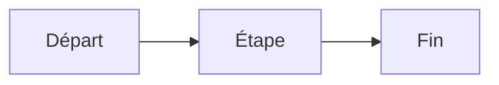
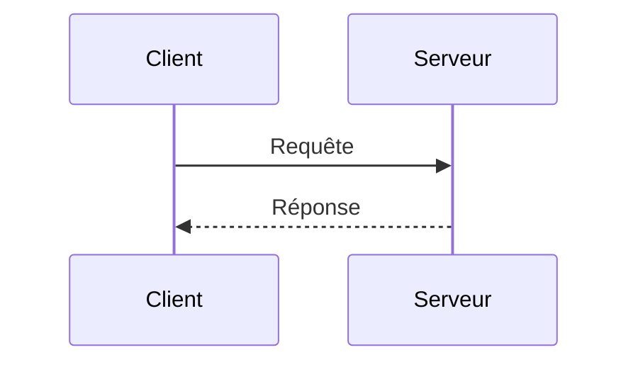

# Module Markdown & Obsidian — Fichiers `.md`

> [!note]
> **Objectif** : Maîtriser **Markdown** pour produire des documents `.md` **clairs, robustes et portables**, et exploiter **Obsidian** (Mac) efficacement : frontmatter YAML, liens wiki, callouts, Mermaid, maths, pièces jointes, transclusions, templates, et bonnes pratiques.
>
> **À la fin de ce module, vous saurez :**
> - Écrire du **Markdown standard (CommonMark/GFM)** : titres, listes, liens, images, code, tableaux.
> - Structurer vos notes avec **frontmatter YAML**, **tags**, **wikilinks**, **backlinks**.
> - Utiliser les **callouts Obsidian**, **Mermaid**, **math LaTeX**, **footnotes**.
> - Gérer **assets** (images, pièces jointes), **transclusions** et **embeds**.
> - Mettre en place **templates** (modèles), **Dataview** (optionnel), **règles de nommage** et **qualité**.

---

## Table des matières

- [1. Markdown : bases & variantes](#1-markdown--bases--variantes)
- [2. Titres, paragraphes & emphases](#2-titres-paragraphes--emphases)
- [3. Listes, quotes, séparateurs](#3-listes-quotes-separateurs)
- [4. Liens & images](#4-liens--images)
- [5. Code, blocs & syntax highlighting](#5-code-blocs--syntax-highlighting)
- [6. Tableaux (GFM)](#6-tableaux-gfm)
- [7. Footnotes & références](#7-footnotes--references)
- [8. Math LaTeX (Obsidian)](#8-math-latex-obsidian)
- [9. Diagrammes Mermaid](#9-diagrammes-mermaid)
- [10. Callouts Obsidian](#10-callouts-obsidian)
- [11. Frontmatter YAML & métadonnées](#11-frontmatter-yaml--metadonnees)
- [12. WikiLinks, backlinks & transclusions](#12-wikilinks-backlinks--transclusions)
- [13. Fichiers & pièces jointes](#13-fichiers--pieces-jointes)
- [14. Templates & modèles de note](#14-templates--modeles-de-note)
- [15. Dataview (optionnel)](#15-dataview-optionnel)
- [16. Nommage, arborescence & conventions](#16-nommage-arborescence--conventions)
- [17. Qualité, portabilité & linting](#17-qualite-portabilite--linting)
- [18. Exercices guidés avec corrections](#18-exercices-guides-avec-corrections)
- [19. Checklists Markdown/Obsidian](#19-checklists-markdownobsidian)
- [20. Glossaire rapide](#20-glossaire-rapide)
- [21. FAQ](#21-faq)
- [22. Références & ressources](#22-references--ressources)

---

## 1. Markdown : bases & variantes

- **CommonMark** : standard de référence Markdown.
- **GFM** (GitHub Flavored Markdown) : extensions (tables, task lists, strikethrough, autolinks…).
- Obsidian supporte **CommonMark + GFM**, plus des **fonctionnalités propres** (callouts, wikilinks, transclusions).

---

## 2. Titres, paragraphes & emphases

- Titres `#` à `######` ; un espace après `#`.
- Emphases : `*italique*`, `**gras**`, `~~barré~~`.
- Sauts de ligne : ligne vide pour nouveaux paragraphes.

```md
# Titre 1
## Titre 2

Texte avec *italique* et **gras**.
```

---

## 3. Listes, quotes, séparateurs

- Listes non ordonnées : `-`, `*`, `+`; ordonnées : `1.` `2.`.
- Sous‑listes : indentées par **2–4 espaces**.
- Citations : `>` ; séparateurs : `---` ou `***`.

```md
- Item
  - Sous‑item
> Citation
---
```

---

## 4. Liens & images

- Liens : `[texte](url)` ; liens automatiques GFM : `<https://exemple.com>`.
- Images : `` ; texte **alt** important pour accessibilité.

```md
[Site officiel](https://exemple.com)

```

> [!tip]
> Placez vos **images** dans un dossier `assets/img/` et utilisez des chemins **relatifs**.

---

## 5. Code, blocs & syntax highlighting

- Inline : `` `code` `` ; blocs : triple ```` ```lang ````.
- Utilisez la **langue** (ex. `js`, `ts`, `bash`, `html`, `css`) pour la coloration.

```js
function hello(name){
  console.log(`Bonjour ${name}`)
}
```

---

## 6. Tableaux (GFM)

- GFM autorise tableaux simples ; alignez avec `:`.

```md
| Colonne | Valeur |
|:-------:|-------:|
| A       |    10  |
```

---

## 7. Footnotes & références

- Obsidian prend en charge `[^note]`.

```md
Texte avec note[^1].

[^1]: Détail de la note.
```

---

## 8. Math LaTeX (Obsidian)

- Inline : `$E=mc^2$`; bloc : `$$ ... $$`.

```md
$$
\int_0^1 x^2\,dx = \frac{1}{3}
$$
```

---

## 9. Diagrammes Mermaid

- Diagrammes dans blocs ```mermaid```.



---

## 10. Callouts Obsidian

- Syntaxe :

```md
> [!note]
> Ceci est une note.
> [!warning]
> Attention aux pièges.
```

---

## 11. Frontmatter YAML & métadonnées

- En tête entre `---` : titre, tags, dates.

```yaml
---
title: Exemple de note
tags: [projet, doc]
created: 2025-12-23
updated: 2025-12-23
---
```

> [!tip]
> Utilisez **tags** pour organiser, et `updated` pour le suivi.

---

## 12. WikiLinks, backlinks & transclusions

- WikiLinks : `[[Nom-de-note]]` ; section : `[[Note#Section]]`.
- **Transclusion** (embed) : `![[Note]]` ou `![[Note#Bloc]]`.

```md
Voir [[Guide Markdown]].
Inclure ![[Guide Markdown#Table des matières]].
```

---

## 13. Fichiers & pièces jointes

- Images/PDF dans `assets/` ; utilisez **chemins relatifs**.
- Préférez des **noms décents** (`kebab-case`), sans espaces.

> [!warning]
> Évitez chemins absolus ; cela **casse** la portabilité entre appareils.

---

## 14. Templates & modèles de note

- Créez des **modèles** réutilisables : frontmatter, sections standard, checklist.
- Obsidian **Templates**/Templater (plugin) pour insérer date, titre, etc.

```md
---
title: {{title}}
tags: [note]
created: {{date}}
updated: {{date}}
---

# {{title}}

## Contexte

## Contenu

## Actions
- [ ] À faire 1
- [ ] À faire 2
```

---

## 15. Dataview (optionnel)

- Plugin **Dataview** : requêtes sur frontmatter et contenu.

```md
```dataview
TABLE title, updated
FROM "notes"
WHERE contains(tags, "projet")
SORT updated desc
```
```

> [!note]
> Dataview requiert le **plugin** dédié. Utilisez‑le pour des **tableaux indexés** de vos notes.

---

## 16. Nommage, arborescence & conventions

- **kebab‑case** pour fichiers (`module-markdown.md`).
- **Dossiers** : `notes/`, `modules/`, `assets/img/`, `assets/docs/`.
- **Préfixes** utiles : `Module-`, `Guide-`, `Sommaire-` pour classification rapide.

---

## 17. Qualité, portabilité & linting

- Respectez **CommonMark/GFM** pour compatibilité (GitHub, IDE, sites).
- Utilisez des **linter/formatters** Markdown (ex. `markdownlint`) pour uniformiser.
- Vérifiez **liens** et **images** (chemins), **footnotes**, **titres uniques**.

---

## 18. Exercices guidés avec corrections

> [!info]
> Les **corrections** sont **repliables**. Cliquez pour afficher.

### Exercice 1 — Frontmatter & structure
**Objectif** : Créer une note avec frontmatter, table des matières, sections standard.

<details>
<summary><strong>Correction</strong></summary>

```md
---
title: Ma note
tags: [note, exemple]
created: 2025-12-23
updated: 2025-12-23
---

## Table des matières
- [Contexte](#contexte)
- [Contenu](#contenu)
- [Actions](#actions)

## Contexte
...
## Contenu
...
## Actions
- [ ] Tâche 1
```

</details>

---

### Exercice 2 — WikiLinks & transclusion
**Objectif** : Créer deux notes reliées et embedder une section.

<details>
<summary><strong>Correction</strong></summary>

```md
Voir [[Note-B]].
![[Note-B#Résumé]]
```

</details>

---

### Exercice 3 — Mermaid & callouts
**Objectif** : Ajouter un diagramme et deux callouts.

<details>
<summary><strong>Correction</strong></summary>

```md


> [!note]
> Ceci est une note.
> [!warning]
> Ceci est un avertissement.
```

</details>

---

### Exercice 4 — Tableaux & footnotes
**Objectif** : Créer un tableau GFM et une footnote.

<details>
<summary><strong>Correction</strong></summary>

```md
| Tâche | État |
|------|------|
| A    | OK   |

Texte avec note[^a].

[^a]: Détail.
```

</details>

---

## 19. Checklists Markdown/Obsidian

- [ ] Frontmatter YAML présent et correct
- [ ] Titres hiérarchisés, table des matières
- [ ] Liens relatifs ; images avec `alt` ; chemins `assets/`
- [ ] Code fenced avec langue ; tableaux GFM au besoin
- [ ] Callouts, Mermaid, math si utile
- [ ] WikiLinks et transclusions pertinentes
- [ ] Nommage `kebab-case` ; arborescence claire
- [ ] `markdownlint` OK ; liens valides

---

## 20. Glossaire rapide

- **CommonMark** : standard de base Markdown.
- **GFM** : extensions de GitHub (tables, tasks…).
- **Frontmatter YAML** : métadonnées en tête de note.
- **WikiLink** : lien interne `[[Note]]` propre à Obsidian.
- **Transclusion** : inclusion du contenu d’une autre note (`![[Note]]`).
- **Callout** : encart d’information dans Obsidian.

---

## 21. FAQ

**Q : Mon tableau ne s’aligne pas ?**
> Utilisez `:` pour centrer/droite/gauche, et des `|` réguliers.

**Q : Les callouts s’affichent ailleurs que dans Obsidian ?**
> Non, c’est un **superset**. Sur GitHub, ils seront rendus comme des citations.

**Q : Les liens absolus cassent ?**
> Oui, préférez **chemins relatifs** pour portabilité.

---

## 22. Références & ressources

- CommonMark — Spec : https://spec.commonmark.org/
- GitHub Flavored Markdown — Guide : https://github.github.com/gfm/
- Obsidian — Help : https://help.obsidian.md/
- Markdownlint : https://github.com/DavidAnson/markdownlint

> [!success]
> Vous disposez maintenant d’un **module Markdown & Obsidian complet**, prêt à l’emploi et à la production.
