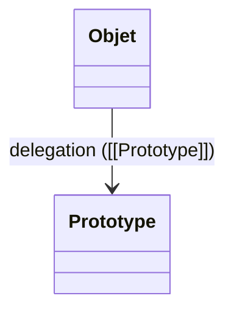

# Module POO en JavaScript — Complet et Opérationnel

> [!note]
> **Objectif** : Maîtriser la **Programmation Orientée Objet (POO)** en **JavaScript** (prototypes, classes ES2015+, encapsulation, héritage, polymorphisme, composition, patterns) pour concevoir des applications **robustes, maintenables et performantes**.
>
> **À la fin de ce module, vous saurez :**
> - Comprendre le **modèle objet prototype‑based** de JS et l’implémentation **class‑like** moderne.
> - Manipuler **objets**, **constructeurs**, **chaîne de prototypes**, **descripteurs de propriétés** et **Symbol**.
> - Écrire des **classes** avec **champs privés**, **getters/setters**, **méthodes statiques**, **blocs statiques**, **héritage** et **super**.
> - Appliquer **encapsulation**, **polymorphisme**, **composition**, **mixins**, **delegation** et **interfaces** (via JSDoc/TypeScript).
> - Utiliser **Proxy**, **Reflect**, **Object.create/defineProperty**, itérateurs et **Generators**.
> - Mettre en œuvre **patterns** (Factory, Strategy, Observer, Decorator, Adapter, Singleton — avec prudence, Module) et **architectures** orientées objets.
>
> *Compatible Obsidian (Mac) : frontmatter YAML, callouts, Mermaid, `<details>` pour corrections d’exercices.*

---

## Table des matières

- [1. Préambule : JS et la POO](#1-preambule--js-et-la-poo)
- [2. Objets & prototypes](#2-objets--prototypes)
- [3. Constructeurs & `new`](#3-constructeurs--new)
- [4. Chaîne de prototypes & délégation](#4-chaine-de-prototypes--delegation)
- [5. Descripteurs de propriétés & API Object](#5-descripteurs-de-proprietes--api-object)
- [6. Symbol & itération](#6-symbol--iteration)
- [7. Classes ES (ES2015+) & champs privés](#7-classes-es-es2015--champs-prives)
- [8. Héritage, `super`, polymorphisme](#8-heritage-super-polymorphisme)
- [9. Encapsulation : privés, closures & modules](#9-encapsulation--prives-closures--modules)
- [10. Composition, mixins & delegation](#10-composition-mixins--delegation)
- [11. Patterns orientés objets](#11-patterns-orientes-objets)
- [12. Proxy, Reflect et métaprogrammation](#12-proxy-reflect-et-metaprogrammation)
- [13. Itérateurs & Generators](#13-iterateurs--generators)
- [14. Architecture & bonnes pratiques](#14-architecture--bonnes-pratiques)
- [15. Performance & mémoire](#15-performance--memoire)
- [16. Tests & qualité (Jest/Vitest)](#16-tests--qualite-jestvitest)
- [17. Exercices guidés avec corrections](#17-exercices-guides-avec-corrections)
- [18. Checklists POO JavaScript](#18-checklists-poo-javascript)
- [19. Glossaire rapide](#19-glossaire-rapide)
- [20. FAQ](#20-faq)
- [21. Références & ressources](#21-references--ressources)

---

## 1. Préambule : JS et la POO

**JavaScript** est un langage **prototype‑based** : les objets héritent via une **chaîne de prototypes**. Les **classes** (ES2015+) sont une **syntaxe** au‑dessus de ce modèle.

> [!tip]
> Pensez la POO en JS comme **« délégation »** (prototypes) plutôt que « classes strictes ».



---

## 2. Objets & prototypes

- Littéraux `{}` ; `Object.create(proto)` pour délégation contrôlée.
- Accès au prototype : `Object.getPrototypeOf(obj)` ; modification : `Object.setPrototypeOf(obj, proto)` (évitez pour perf ; préférez `Object.create`).
- Méthodes communes : `hasOwnProperty`, `toString`, `valueOf`.

```js
const proto = { greet(){ return `Bonjour ${this.name}` } }
const user = Object.create(proto)
user.name = 'Alice'
user.greet() // "Bonjour Alice"
```

---

## 3. Constructeurs & `new`

- **Fonction constructeur** : convention `PascalCase`.
- `new` crée un objet, **assigne** son `[[Prototype]]` et **appelle** la fonction avec `this`.

```js
function Person(name){ this.name = name }
Person.prototype.say = function(){ return `Je suis ${this.name}` }
const p = new Person('Bob')
p.say()
```

---

## 4. Chaîne de prototypes & délégation

- Chaque objet pointe vers un **prototype** ; la **recherche** de propriété remonte la chaîne.
- Utilisez la **délégation** pour partager du comportement sans copier.

```js
const a = { x: 1 }
const b = Object.create(a)
console.log(b.x) // 1 (depuis a)
```

---

## 5. Descripteurs de propriétés & API Object

- `Object.defineProperty(obj, key, { value, writable, enumerable, configurable })`.
- **Getters/Setters** via descripteurs ; **immuabilité** via `Object.freeze`.

```js
const user2 = {}
Object.defineProperty(user2, 'id', { value: 123, writable: false })
```

---

## 6. Symbol & itération

- **Symbol** uniques pour clés privées **faiblement** privées.
- Protocoles d’itération : `Symbol.iterator`, `Symbol.asyncIterator`.

```js
const ID = Symbol('id')
const obj = { [ID]: 42 }
for (const k in obj) console.log(k) // n'affiche pas Symbol
```

---

## 7. Classes ES (ES2015+) & champs privés

- `class` avec **méthodes**, **get/set**, **static**, **static blocks**, **champs privés** (`#secret`).

```js
class Account {
  #balance = 0
  constructor(owner){ this.owner = owner }
  deposit(n){ this.#balance += n }
  get balance(){ return this.#balance }
  static from(owner, amount){ const a = new Account(owner); a.deposit(amount); return a }
  static { /* init static */ }
}
```

> [!warning]
> Les **champs privés** sont **inaccessibles** hors de la classe (même via `this['#x']`).

---

## 8. Héritage, `super`, polymorphisme

- `extends` pour hériter ; `super()` pour initialiser le parent.
- **Polymorphisme** : même interface, implémentations différentes.

```js
class Shape { area(){ throw new Error('abstract') } }
class Rect extends Shape { constructor(w,h){ super(); this.w=w; this.h=h } area(){ return this.w*this.h } }
class Circle extends Shape { constructor(r){ super(); this.r=r } area(){ return Math.PI*this.r*this.r } }
const shapes = [ new Rect(10,20), new Circle(10) ]
shapes.map(s => s.area())
```

---

## 9. Encapsulation : privés, closures & modules

- **Privés** via `#` ; via **closures** (variables dans le scope) ; via **Module Pattern** (`IIFE`).

```js
function makeCounter(){ let c=0; return { inc(){ c++ }, get value(){ return c } } }
```

---

## 10. Composition, mixins & delegation

- **Composition > hérité** pour réduire couplage.
- **Mixins** : fonctions qui **ajoutent** des capacités à un objet.

```js
const canLog = (o) => Object.assign(o, { log(){ console.log(this) } })
const o = canLog({ a:1 })
o.log()
```

---

## 11. Patterns orientés objets

- **Factory** : crée objets sans `new` exposé.
- **Strategy** : varie l’algorithme.
- **Observer/EventEmitter** : notifications.
- **Decorator** : ajoute des responsabilités.
- **Adapter** : convertit une interface.
- **Singleton** : instance unique (utiliser avec **prudence**).
- **Module** : encapsulation via scope.

```js
class EventEmitter{
  #m = new Map()
  on(t, h){ const a=this.#m.get(t)||[]; a.push(h); this.#m.set(t,a) }
  off(t, h){ const a=this.#m.get(t)||[]; this.#m.set(t, a.filter(x=>x!==h)) }
  emit(t, ...args){ (this.#m.get(t)||[]).forEach(h=>h(...args)) }
}
```

---

## 12. Proxy, Reflect et métaprogrammation

- **Proxy** intercepte opérations (get/set/has/apply). 
- **Reflect** propose équivalents **sûrs** des opérations bas niveau.

```js
const user = { name: 'Alice', age: 30 }
const p = new Proxy(user, {
  set(t, k, v){ if(k==='age' && v<0) throw new Error('age invalid'); return Reflect.set(t,k,v) }
})
```

---

## 13. Itérateurs & Generators

- **Itérateurs** : objet avec `next()`.
- **Generators** (`function*`) créent simplement itérateurs.

```js
function* range(a,b){ for(let i=a;i<=b;i++) yield i }
[...range(1,3)] // [1,2,3]
```

---

## 14. Architecture & bonnes pratiques

- **SOLID** adapté au JS (ex. **S** responsabilité unique, **O** ouvert/fermé via composition).
- **KISS/DRY** ; limiter héritage profond ; **interfaces** via JSDoc/TS.
- Séparer **données** / **comportement** ; services vs modèles.

---

## 15. Performance & mémoire

- Éviter recréer fonctions par instance si inutile (préférez prototype/class methods).
- Nettoyer **listeners** (Observer) ; faibles références (WeakMap/WeakSet).
- Mesurer via **Performance** et **Memory** (DevTools).

---

## 16. Tests & qualité (Jest/Vitest)

- Tester **comportement** des classes, **contrats** d’interface.
- Mock pour Observer/Strategy ; vérifiez **erreurs** attendues.

```js
// Exemple (Vitest)
import { describe, it, expect } from 'vitest'
describe('Rect', () => {
  it('area', () => { const r={ w:2, h:3 }; expect(r.w*r.h).toBe(6) })
})
```

---

## 17. Exercices guidés avec corrections

> [!info]
> Les **corrections** sont **repliables**. Cliquez pour afficher.

### Exercice 1 — Chaîne de prototypes
**Objectif** : Créer un objet déléguant à un prototype avec méthode `greet`.

<details>
<summary><strong>Correction</strong></summary>

```js
const proto = { greet(){ return `Bonjour ${this.name}` } }
const user = Object.create(proto)
user.name = 'Alice'
console.log(user.greet())
```

</details>

---

### Exercice 2 — Classe avec champs privés
**Objectif** : Écrire `Account` avec `#balance`, `deposit`, getter `balance`.

<details>
<summary><strong>Correction</strong></summary>

```js
class Account {
  #balance = 0
  constructor(owner){ this.owner = owner }
  deposit(n){ this.#balance += n }
  get balance(){ return this.#balance }
}
const a = new Account('Bob'); a.deposit(100); console.log(a.balance)
```

</details>

---

### Exercice 3 — Polymorphisme (Shape)
**Objectif** : Implémenter `Rect` et `Circle` avec `area()` et utiliser un tableau polymorphe.

<details>
<summary><strong>Correction</strong></summary>

```js
class Shape { area(){ throw new Error('abstract') } }
class Rect extends Shape { constructor(w,h){ super(); this.w=w; this.h=h } area(){ return this.w*this.h } }
class Circle extends Shape { constructor(r){ super(); this.r=r } area(){ return Math.PI*this.r*this.r } }
const shapes = [ new Rect(2,3), new Circle(1) ]
console.log(shapes.map(s=>s.area()))
```

</details>

---

### Exercice 4 — EventEmitter (Observer)
**Objectif** : Créer un bus d’événements avec `on`, `off`, `emit`.

<details>
<summary><strong>Correction</strong></summary>

```js
class EventEmitter{
  #m = new Map()
  on(t, h){ const a=this.#m.get(t)||[]; a.push(h); this.#m.set(t,a) }
  off(t, h){ const a=this.#m.get(t)||[]; this.#m.set(t, a.filter(x=>x!==h)) }
  emit(t, ...args){ (this.#m.get(t)||[]).forEach(h=>h(...args)) }
}
const bus = new EventEmitter()
const h = (...x)=>console.log('ping',...x)
bus.on('ping', h)
bus.emit('ping', 1)
bus.off('ping', h)
```

</details>

---

### Exercice 5 — Strategy
**Objectif** : Implémenter deux stratégies de tri et un contexte qui les applique.

<details>
<summary><strong>Correction</strong></summary>

```js
const asc = (a,b)=>a-b
const desc = (a,b)=>b-a
function sortWith(strategy, arr){ return [...arr].sort(strategy) }
console.log(sortWith(asc, [3,1,2]))
console.log(sortWith(desc, [3,1,2]))
```

</details>

---

### Exercice 6 — Proxy de validation
**Objectif** : Intercepter `set` pour valider champ `age >= 0`.

<details>
<summary><strong>Correction</strong></summary>

```js
const model = { name:'Alice', age:30 }
const v = new Proxy(model, {
  set(t,k,v){ if(k==='age' && v<0) throw new Error('age invalide'); return Reflect.set(t,k,v) }
})
v.age = 10
```

</details>

---

### Exercice 7 — Mixins & composition
**Objectif** : Ajouter une capacité `log()` à un objet via mixin.

<details>
<summary><strong>Correction</strong></summary>

```js
const canLog = (o) => Object.assign(o, { log(){ console.log(this) } })
const o = canLog({ a:1 })
o.log()
```

</details>

---

## 18. Checklists POO JavaScript

### Base
- [ ] Chaîne de prototypes comprise ; `Object.create` préféré à `setPrototypeOf`
- [ ] Constructeurs/prototypes maîtrisés ; méthodes partagées
- [ ] Descripteurs (`defineProperty`) ; getters/setters ; immuabilité (`freeze`)
- [ ] Symbol pour clés non énumérables ; itération via `Symbol.iterator`

### Classes & Encapsulation
- [ ] `class` avec champs privés (`#`) ; `get/set` ; `static`
- [ ] Héritage `extends` ; `super()` ; overriding propre
- [ ] Encapsulation via **privés** ou **closures** ; **Module Pattern**

### Patterns & Métaprogrammation
- [ ] Factory/Strategy/Observer/Decorator/Adapter/Module ; **Singleton** évité
- [ ] Proxy/Reflect pour validation/logging ; **itérateurs/generators** pour parcours

### Perf & Qualité
- [ ] Méthodes sur prototype pour éviter duplication
- [ ] Nettoyage des listeners ; `WeakMap/WeakSet` pour caches
- [ ] Tests unitaires sur contrats ; DevTools Performance/Memory

---

## 19. Glossaire rapide

- **Prototype** : objet dont hérite un autre objet.
- **Constructeur** : fonction appelée avec `new` pour initialiser un objet.
- **Encapsulation** : cacher les détails internes et exposer une API claire.
- **Polymorphisme** : plusieurs implémentations pour une même interface.
- **Composition** : assembler des fonctionnalités plutôt qu’hériter.
- **Mixin** : fonction qui ajoute des capacités à un objet.
- **Proxy/Reflect** : interception et API bas niveau pour opérations objets.

---

## 20. FAQ

**Q : Les classes remplacent‑elles les prototypes ?**
> Non. Les classes sont une **syntaxe** au‑dessus des **prototypes**.

**Q : Faut‑il utiliser Singleton ?**
> Rarement. Il **couple** fort et complique les tests. Préférez **injection** ou **modules**.

**Q : Comment simuler des interfaces ?**
> Via **JSDoc**/**TypeScript** pour le typage et les **contrats** ; ou tests de forme (duck typing).

**Q : Privés `#` ou closures ?**
> `#` est **natif** et robuste ; closures excellentes pour modules/factories.

---

## 21. Références & ressources

- MDN Web Docs — Objets et prototypes : https://developer.mozilla.org/fr/docs/Web/JavaScript/Inheritance_and_the_prototype_chain
- MDN — `class` & champs privés : https://developer.mozilla.org/fr/docs/Web/JavaScript/Reference/Classes ; https://developer.mozilla.org/fr/docs/Web/JavaScript/Reference/Classes/Private_class_fields
- MDN — `Object.create` / `defineProperty` : https://developer.mozilla.org/fr/docs/Web/JavaScript/Reference/Global_Objects/Object/create ; https://developer.mozilla.org/fr/docs/Web/JavaScript/Reference/Global_Objects/Object/defineProperty
- MDN — Proxy & Reflect : https://developer.mozilla.org/fr/docs/Web/JavaScript/Reference/Global_Objects/Proxy ; https://developer.mozilla.org/fr/docs/Web/JavaScript/Reference/Global_Objects/Reflect
- MDN — Iteration protocol & Generators : https://developer.mozilla.org/fr/docs/Web/JavaScript/Reference/Iteration_protocols ; https://developer.mozilla.org/fr/docs/Web/JavaScript/Reference/Global_Objects/Generator

> [!success]
> Vous disposez maintenant d’un **module POO JavaScript complet**, prêt à l’emploi et à la production.
