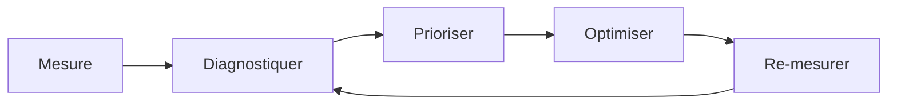

# Module Performance & SEO — Complet et Opérationnel

> [!note]
> **Objectif** : Optimiser **vitesse de chargement**, **stabilité visuelle**, **interactivité** et **référencement** d’un site web moderne, avec des techniques **mesurables** et **reproductibles**.
>
> **À la fin de ce module, vous saurez :**
> - Mesurer et améliorer les **Core Web Vitals** (LCP, CLS, INP) et indicateurs clés (TTFB, FCP, TTI).
> - Réduire les **ressources bloquantes**, optimiser **images**, **polices**, **scripts** et **styles**.
> - Mettre en place **caching**, **HTTP/2/3**, **preload/prefetch/preconnect**, **priority hints**.
> - Structurer un **SEO technique** solide (balises, canonical, robots, sitemap, hreflang, données structurées JSON‑LD).
> - Configurer la **mesure** (Lighthouse, PageSpeed, WebPageTest), le **monitoring** et la **Search Console**.
>
> *Ce module est compatible Obsidian (Mac) : callouts, Mermaid, `<details>` pour corrections d’exercices.*

---

## Table des matières

- [1. Mesurer avant d’optimiser](#1-mesurer-avant-doptimiser)
- [2. Core Web Vitals et objectifs](#2-core-web-vitals-et-objectifs)
- [3. Réduire les ressources bloquantes](#3-reduire-les-ressources-bloquantes)
- [4. Images : formats, responsives, LCP](#4-images--formats-responsives-lcp)
- [5. Polices : performances & affichage](#5-polices--performances--affichage)
- [6. JavaScript : taille, exécution et livraison](#6-javascript--taille-execution-et-livraison)
- [7. Réseau : HTTP/2/3, cache, compression](#7-reseau--http23-cache-compression)
- [8. Hints & Priorités de ressources](#8-hints--priorites-de-ressources)
- [9. SEO technique — bases indispensables](#9-seo-technique--bases-indispensables)
- [10. International & hreflang](#10-international--hreflang)
- [11. Données structurées (JSON‑LD)](#11-donnees-structurees-json-ld)
- [12. Indexation, robots & sitemap](#12-indexation-robots--sitemap)
- [13. Contenu, E‑E‑A‑T & maillage interne](#13-contenu-e-e-a-t--maillage-interne)
- [14. Mesure & monitoring](#14-mesure--monitoring)
- [15. Sécurité & conformité SEO](#15-securite--conformite-seo)
- [16. Exercices guidés avec corrections](#16-exercices-guides-avec-corrections)
- [17. Checklists Performance & SEO](#17-checklists-performance--seo)
- [18. Glossaire rapide](#18-glossaire-rapide)
- [19. FAQ](#19-faq)
- [20. Références & ressources](#20-references--ressources)

---

## 1. Mesurer avant d’optimiser

> [!tip]
> **Mesurez** dans des conditions réalistes : réseau 4G/3G, mobile milieu de gamme, cache froid/chaud. Combinez **laboratoire** (Lighthouse) et **terrain** (RUM, Search Console).

Outils & modes :
- **Lighthouse** (Chrome DevTools) — audit labo.
- **PageSpeed Insights** — agrège données **CrUX** (réelles) + labo.
- **WebPageTest** — scénario avancé, vidéo, filmstrip, différentiel.
- **Profiler** (Performance) dans DevTools — longueurs de tâches, layout/paint.



---

## 2. Core Web Vitals et objectifs

- **LCP (Largest Contentful Paint)** : temps d’affichage du **plus grand élément** du viewport. **Objectif ≤ 2.5 s**.
- **CLS (Cumulative Layout Shift)** : **stabilité visuelle** (pas de sauts). **Objectif ≤ 0.1**.
- **INP (Interaction to Next Paint)** : réactivité globale aux interactions. **Objectif ≤ 200 ms**.

Autres indicateurs : **TTFB**, **FCP**, **TTI**, **TBT** (labo), **FID** (historique, remplacé par INP).

> [!warning]
> LCP est souvent impacté par **images Héros** et **polices**. CLS par **dimensions média** non définies et bannières tardives. INP par **JS lourd** et **longues tâches**.

---

## 3. Réduire les ressources bloquantes

- **Critical CSS** : inliner le **minimal** nécessaire pour le above‑the‑fold ; le reste en `media` ou `defer` (via `loadCSS` ou `rel=preload` + `onload`).
- **JavaScript** :
  - `defer` pour scripts non critiques.
  - `type="module"` + `modulepreload` pour ESM.
  - **Code splitting** et **lazy‑loading** (routes, composants).
- **Ordre de chargement** : HTML → CSS critique → polices → image LCP.

```html
<link rel="preload" href="/css/critical.css" as="style" onload="this.rel='stylesheet'">
<noscript><link rel="stylesheet" href="/css/critical.css"></noscript>
<script src="/js/app.js" defer></script>
```

---

## 4. Images : formats, responsives, LCP

- Formats **modernes** : **AVIF**, **WebP** ; fallback JPEG/PNG.
- **Responsive** : `srcset` + `sizes` ; `<picture>` pour formats.
- **Dimensions** (`width`/`height`) pour éviter **CLS**.
- **Lazy‑loading** (`loading="lazy"`) hors viewport ; **priority** pour Héros.

```html

```

> [!tip]
> **Compressez** (lossy) et servez à la **bonne taille**. Évitez les images **scalées** à l’excès.

---

## 5. Polices : performances & affichage

- Utilisez **WOFF2** (variable si possible). Déclarez **`font-display: swap`**.
- **Preload** les polices **critiques** (texte Héros), attention à la taille.
- Limitez variantes (poids/styles) ; **subset** si nécessaire.

```css
@font-face {
  font-family: "Inter";
  src: url("/fonts/Inter.woff2") format("woff2");
  font-weight: 100 900;
  font-display: swap;
}
```

---

## 6. JavaScript : taille, exécution et livraison

- **Réduire** le JS : pas de librairies inutiles, préférer **APIs natives**.
- **Arboriser** (tree shaking) avec **ESM** ; éviter **side effects**.
- Découper en **chunks** ; charger **à la demande** (dynamic import).
- **Eviter longues tâches** (> 50 ms) : fractionner, `requestIdleCallback`.
- **Workers** pour calculs lourds.

```js
// Chargement à la demande
import('./charts.js').then(m => m.render())
```

---

## 7. Réseau : HTTP/2/3, cache, compression

- **HTTP/2** : multiplexage, entêtes HPACK ; **HTTP/3** : QUIC (latence réduite).
- **Compression** : Gzip/Brotli (texte), **minification** CSS/JS/HTML.
- **Cache** :
  - `Cache-Control: max-age=31536000, immutable` pour assets versionnés.
  - `ETag` ou `Last-Modified` pour HTML.

```nginx
# Exemples d'entêtes côté serveur
location ~* \.(js|css|woff2|svg)$ {
  add_header Cache-Control "public, max-age=31536000, immutable";
}
location ~* \.(html)$ {
  add_header Cache-Control "no-cache";
}
```

---

## 8. Hints & Priorités de ressources

- **Preconnect** : `link rel="preconnect" href="https://cdn.example.com" crossorigin`.
- **DNS Prefetch** : `link rel="dns-prefetch" href="//cdn.example.com"`.
- **Preload** : CSS/JS/polices/images critiques.
- **Prefetch** (navigations probables) : `rel="prefetch"`.
- **Priority hints** : `fetchpriority="high|low"` (images, parfois iframes).
- **modulepreload** pour ESM.

> [!warning]
> **Mesurez** l’effet des hints : trop de preloads **saturent** la bande passante et **dégradent** LCP.

---

## 9. SEO technique — bases indispensables

- **Balises** : `title` unique, **meta description**, **robots** (noindex/nofollow), **canonical**.
- **Structure** sémantique (H1→H2→H3), **accessibilité** (alt, landmarks).
- **URL propres** (kebab‑case), redirections 301 cohérentes, éviter duplication.
- **Open Graph / Twitter Cards** pour partage.

```html
<link rel="canonical" href="https://exemple.com/article">
<meta name="description" content="Résumé clair et pertinent (150–160 caractères).">
<meta property="og:title" content="Titre">
<meta property="og:image" content="https://exemple.com/og.jpg">
```

---

## 10. International & hreflang

- Ajouter **`hreflang`** par version linguistique ; inclure **x‑default**.
- Cohérence **URL** ↔ langue ↔ **Search Console** propriétés.

```html
<link rel="alternate" href="https://exemple.com/fr/article" hreflang="fr">
<link rel="alternate" href="https://exemple.com/en/article" hreflang="en">
<link rel="alternate" href="https://exemple.com/" hreflang="x-default">
```

---

## 11. Données structurées (JSON‑LD)

- **Article**, **BreadcrumbList**, **Product**, **Organization**…
- En **`<script type="application/ld+json">`** ; **valider** (Rich Results Test).

```html
<script type="application/ld+json">
{
  "@context": "https://schema.org",
  "@type": "Article",
  "headline": "Optimiser Performance & SEO",
  "datePublished": "2025-12-23",
  "author": {"@type": "Person", "name": "Vous"},
  "image": "https://exemple.com/og.jpg"
}
</script>
```

---

## 12. Indexation, robots & sitemap

- **robots.txt** : autoriser/désautoriser répertoires.
- **Meta robots** ou **X‑Robots‑Tag** (headers).
- **Sitemap XML** : URLs canoniques + `lastmod` ; **sitemap hreflang** possible.

```txt
# robots.txt
User-agent: *
Disallow: /admin/
Allow: /public/
Sitemap: https://exemple.com/sitemap.xml
```

```xml
<!-- sitemap.xml -->
<urlset xmlns="http://www.sitemaps.org/schemas/sitemap/0.9">
  <url>
    <loc>https://exemple.com/</loc>
    <lastmod>2025-12-23</lastmod>
  </url>
</urlset>
```

---

## 13. Contenu, E‑E‑A‑T & maillage interne

- **Qualité** : contenu utile, original, mis à jour ; **intent** utilisateur.
- **E‑E‑A‑T** : Experience, Expertise, Authoritativeness, Trustworthiness.
- **Maillage** : liens internes descriptifs, **breadcrumb**, **pagination**.
- **Images** : `alt` descriptif ; **captions** si pertinent.

---

## 14. Mesure & monitoring

- **Lighthouse CI** (intégration continue).
- **Chrome User Experience Report (CrUX)** via PageSpeed.
- **Search Console** : couverture (indexation), améliorations, Core Web Vitals.
- **RUM** (Real User Monitoring) : injecter mesures via `web-vitals` et remonter (Analytics).

```js
import { onLCP, onCLS, onINP } from 'web-vitals'
onLCP(console.log)
onCLS(console.log)
onINP(console.log)
```

---

## 15. Sécurité & conformité SEO

- **HTTPS** partout ; redirection HTTP→HTTPS.
- **CSP**, **SRI** pour assets tiers.
- **Canonicalisation** : www vs non‑www, trailing slash, paramètres.
- **404** vs **410** selon cas ; **5xx** évités (disponibilité).

---

## 16. Exercices guidés avec corrections

> [!info]
> Les **corrections** sont **repliables**. Cliquez pour afficher.

### Exercice 1 — Optimiser une image Héros (LCP)
**Objectif** : Marquer l’image Héros avec formats modernes, `srcset/sizes`, dimensions et priorité.

<details>
<summary><strong>Correction</strong></summary>

```html
<picture>
  <source srcset="/img/hero.avif" type="image/avif">
  <source srcset="/img/hero.webp" type="image/webp">
  
</picture>
```

</details>

---

### Exercice 2 — Preconnect & Preload judicieusement
**Objectif** : Ajouter preconnect vers un CDN et preloader une police critique variable.

<details>
<summary><strong>Correction</strong></summary>

```html
<link rel="preconnect" href="https://cdn.example.com" crossorigin>
<link rel="preload" href="/fonts/Inter.woff2" as="font" type="font/woff2" crossorigin>
```

</details>

---

### Exercice 3 — Critical CSS + defer scripts
**Objectif** : Inliner CSS critique et différer le reste + scripts.

<details>
<summary><strong>Correction</strong></summary>

```html
<style>/* minimal critical */ body{margin:0;font:1rem/1.5 system-ui}</style>
<link rel="preload" href="/css/app.css" as="style" onload="this.rel='stylesheet'">
<noscript><link rel="stylesheet" href="/css/app.css"></noscript>
<script src="/js/app.js" defer></script>
```

</details>

---

### Exercice 4 — Balises SEO de base
**Objectif** : Ajouter title, description, canonical, OG.

<details>
<summary><strong>Correction</strong></summary>

```html
<title>Guide Performance & SEO</title>
<meta name="description" content="Apprenez à optimiser vitesse et référencement web.">
<link rel="canonical" href="https://exemple.com/guide-performance-seo">
<meta property="og:title" content="Guide Performance & SEO">
<meta property="og:description" content="Optimisation Core Web Vitals et SEO technique.">
<meta property="og:image" content="https://exemple.com/og.jpg">
```

</details>

---

### Exercice 5 — JSON‑LD Article
**Objectif** : Ajouter des données structurées valides.

<details>
<summary><strong>Correction</strong></summary>

```html
<script type="application/ld+json">
{
  "@context": "https://schema.org",
  "@type": "Article",
  "headline": "Performance & SEO",
  "datePublished": "2025-12-23",
  "author": {"@type":"Person","name":"Vous"},
  "mainEntityOfPage": {"@type":"WebPage","@id":"https://exemple.com/guide-performance-seo"}
}
</script>
```

</details>

---

### Exercice 6 — robots.txt & sitemap.xml
**Objectif** : Créer robots.txt et sitemap XML minimal.

<details>
<summary><strong>Correction</strong></summary>

```txt
User-agent: *
Disallow: /private/
Sitemap: https://exemple.com/sitemap.xml
```

```xml
<urlset xmlns="http://www.sitemaps.org/schemas/sitemap/0.9">
  <url>
    <loc>https://exemple.com/</loc>
    <lastmod>2025-12-23</lastmod>
  </url>
</urlset>
```

</details>

---

## 17. Checklists Performance & SEO

### Performance
- [ ] LCP ≤ 2.5 s (image Héros optimisée, preloaded si nécessaire)
- [ ] CLS ≤ 0.1 (dimensions médias, placeholders, éviter bannières tardives)
- [ ] INP ≤ 200 ms (JS fractionné, pas de longues tâches, écouteurs efficaces)
- [ ] Critical CSS inline ; CSS non critique différé
- [ ] Scripts `defer` / `type="module"` + `modulepreload`
- [ ] Images AVIF/WebP + `srcset/sizes` ; lazy‑loading hors viewport
- [ ] Polices WOFF2 + `font-display: swap` ; preload mesuré
- [ ] HTTP/2/3 activé ; compression Brotli/Gzip
- [ ] Cache fort sur assets versionnés ; ETag/Last‑Modified sur HTML
- [ ] Hints (`preconnect`, `preload`, `prefetch`, `fetchpriority`) mesurés

### SEO
- [ ] `title` unique, **meta description** claire
- [ ] `canonical` correct ; éviter contenu dupliqué
- [ ] Balises Open Graph / Twitter Cards
- [ ] Structure H1→H2→H3 ; sémantique et accessibilité
- [ ] `robots.txt` et **meta robots** selon besoins
- [ ] **sitemap.xml** soumis à Search Console
- [ ] `hreflang` pour versions internationales + `x-default`
- [ ] Données structurées JSON‑LD validées
- [ ] Maillage interne soigné ; breadcrumbs

---

## 18. Glossaire rapide

- **LCP/CLS/INP** : métriques Core Web Vitals (affichage, stabilité, interactivité).
- **TTFB** : délai avant premier octet.
- **Critical CSS** : styles minimaux pour le premier rendu.
- **Preload/Prefetch/Preconnect** : indices au navigateur pour prioriser/anticiper.
- **Canonical** : URL de référence d’une page.
- **hreflang** : relation entre versions linguistiques.
- **JSON‑LD** : format JSON pour données structurées SEO.

---

## 19. FAQ

**Q : Faut‑il tout précharger ?**
> Non. Le **sur‑preload** peut dégrader LCP. Ciblez **Héros** (image, police titre) et mesurez.

**Q : Single‑Page App et SEO ?**
> Assurez **rendu indexable** (SSR/SSG ou hydration) et routes uniques avec **`<title>`** et **`<meta>`** par page.

**Q : Les Core Web Vitals influencent‑ils le ranking ?**
> Ils sont des **signaux UX** ; un bon contenu reste **primordial**, mais des performances médiocres peuvent **pénaliser** visibilité et conversions.

---

## 20. Références & ressources

- MDN Web Docs — Performance & Réseau : https://developer.mozilla.org/fr/docs/Web/Performance ; https://developer.mozilla.org/fr/docs/Web/HTTP
- web.dev — Core Web Vitals & pratiques : https://web.dev/ ; https://web.dev/vitals/
- Google Search Central — SEO technique : https://developers.google.com/search/docs/fundamentals ; https://developers.google.com/search/docs/appearance/structured-data
- PageSpeed Insights : https://pagespeed.web.dev/
- WebPageTest : https://www.webpagetest.org/
- Schema.org : https://schema.org/

> [!success]
> Vous disposez maintenant d’un **module Performance & SEO complet**, prêt à l’emploi, mesurable et applicable en production.
