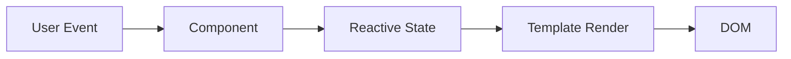

# Module Vue 3 — Complet et Opérationnel

> [!note]
> **Objectif** : Maîtriser **Vue 3** (Composition API, `<script setup>`, Router, Pinia) pour bâtir des applications **modulaires, performantes, accessibles** et prêtes pour la production.
>
> **À la fin de ce module, vous saurez :**
> - Initialiser un projet avec **Vite** et **create‑vue**.
> - Écrire des **Single File Components (SFC)** avec **`<script setup>`** et **TypeScript** (optionnel).
> - Utiliser la **réactivité** (`ref`, `reactive`, `computed`, `watch`) et le **cycle de vie**.
> - Composer la logique avec **composables** réutilisables.
> - Gérer la navigation avec **Vue Router** (routes, paramètres, gardes, lazy‑loading).
> - Structurer l’état global avec **Pinia** (stores, actions, getters).
> - Implémenter **v-model** avancé, formulaires, **transition**/**transition-group**, **Teleport**.
> - Appliquer **accessibilité**, **performance**, **tests** et bonnes pratiques.

---

## Table des matières

- [1. Prérequis & Mise en place](#1-prerequis--mise-en-place)
- [2. Vue 3 : Concepts clés](#2-vue-3--concepts-cles)
- [3. Single File Components (SFC) & `<script setup>`](#3-single-file-components-sfc--script-setup)
- [4. Réactivité : ref, reactive, computed, watch](#4-reactivite--ref-reactive-computed-watch)
- [5. Cycle de vie & gestion des effets](#5-cycle-de-vie--gestion-des-effets)
- [6. Templates, directives & événements](#6-templates-directives--evenements)
- [7. Props, emits & slots (scoped slots)](#7-props-emits--slots-scoped-slots)
- [8. Provide/Inject & communication avancée](#8-provideinject--communication-avancee)
- [9. Composables (Composition API)](#9-composables-composition-api)
- [10. Formulaires & `v-model` avancé](#10-formulaires--v-model-avance)
- [11. Routage avec Vue Router](#11-routage-avec-vue-router)
- [12. État global avec Pinia](#12-etat-global-avec-pinia)
- [13. Transitions, animations & Teleport](#13-transitions-animations--teleport)
- [14. Suspense & chargement asynchrone](#14-suspense--chargement-asynchrone)
- [15. Accessibilité (a11y) avec Vue](#15-accessibilite-a11y-avec-vue)
- [16. Performance & bonnes pratiques](#16-performance--bonnes-pratiques)
- [17. Tests (Vitest) & DevTools](#17-tests-vitest--devtools)
- [18. Organisation du projet & conventions](#18-organisation-du-projet--conventions)
- [19. Exercices guidés avec corrections](#19-exercices-guides-avec-corrections)
- [20. Checklists de référence](#20-checklists-de-reference)
- [21. Glossaire rapide](#21-glossaire-rapide)
- [22. FAQ](#22-faq)
- [23. Références & ressources](#23-references--ressources)

---

## 1. Prérequis & Mise en place

- **Node.js** ≥ 18 (nvm recommandé) ; **npm** ou **pnpm**.
- **create‑vue** pour démarrer rapide.

```bash
npm create vue@latest mon-app
cd mon-app
npm install
npm run dev
```

> [!tip]
> Choisissez **TypeScript** et **Pinia** dès l’initialisation si votre projet exige robustesse et typage.

---

## 2. Vue 3 : Concepts clés

- **SFC** (`.vue`) : `template` + `script` + `style`.
- **Composition API** : logique **fonctionnelle** et **réutilisable** (composables).
- **Réactivité** fine : `ref` (scalaires), `reactive` (objets), `computed`, `watch`.
- **`<script setup>`** : syntaxe **compacte** pour les composants.



---

## 3. Single File Components (SFC) & `<script setup>`

### 3.1. Structure SFC

```vue
<template>
  <h1>{{ title }}</h1>
</template>

<script setup>
import { ref } from 'vue'
const title = ref('Bonjour Vue 3')
</script>

<style scoped>
h1 { color: hsl(220 80% 50%); }
</style>
```

### 3.2. Styles

- `scoped` pour limiter au composant.
- `:deep()` pour cibler descendants dans composants enfants.

### 3.3. TypeScript (optionnel)

```vue
<script setup lang="ts">
import { ref } from 'vue'
const count = ref<number>(0)
</script>
```

---

## 4. Réactivité : ref, reactive, computed, watch

```vue
<script setup>
import { ref, reactive, computed, watch, watchEffect } from 'vue'
const n = ref(1)
const state = reactive({ a: 2, b: 3 })
const sum = computed(() => n.value + state.a + state.b)
watch(() => state.a, (newA, oldA) => console.log('a:', oldA,'→',newA))
watchEffect(() => console.log('sum:', sum.value))
</script>
```

> [!warning]
> Les objets **réactifs** perdent leur réactivité si on les **déstructure**. Préférez l’accès **direct** (`state.a`) ou **`toRefs()`**.

---

## 5. Cycle de vie & gestion des effets

- `onMounted`, `onUpdated`, `onUnmounted`, `onBeforeMount`.
- `onErrorCaptured` pour erreurs enfants.
- `onActivated`/`onDeactivated` avec `<KeepAlive>`.

```vue
<script setup>
import { ref, onMounted, onUnmounted } from 'vue'
const ready = ref(false)
onMounted(() => { ready.value = true })
onUnmounted(() => { /* cleanup */ })
</script>
```

---

## 6. Templates, directives & événements

- **Directives de base** : `v-bind`, `v-on`, `v-if`, `v-else`, `v-show`, `v-for`, `v-model`.
- **Modificateurs** : `@click.stop`, `@submit.prevent`, `v-model.trim`, `v-model.lazy`.

```vue
<template>
  <input v-model.trim="query" placeholder="Recherche…" />
  <ul>
    <li v-for="item in items" :key="item.id" @click.stop="select(item)">{{ item.name }}</li>
  </ul>
</template>
```

> [!warning]
> Évitez `v-html` (risques d’**XSS**). Préférez le rendu textuel ou **sanitisez** en amont.

---

## 7. Props, emits & slots (scoped slots)

### 7.1. Props & Emits (`<script setup>`) 

```vue
<script setup>
const props = defineProps<{ label: string, disabled?: boolean }>()
const emit = defineEmits<{ (e: 'click'): void }>()
function onClick(){ if(!props.disabled) emit('click') }
</script>
```

### 7.2. Slots & scoped slots

```vue
<template>
  <Card>
    <template #header>
      <h2>{{ title }}</h2>
    </template>
    <template #default="{ item }">
      <p>{{ item.text }}</p>
    </template>
  </Card>
</template>
```

---

## 8. Provide/Inject & communication avancée

```vue
<!-- Parent.vue -->
<script setup>
import { provide } from 'vue'
const theme = 'dark'
provide('theme', theme)
</script>

<!-- Child.vue -->
<script setup>
import { inject } from 'vue'
const theme = inject('theme', 'light')
</script>
```

> [!tip]
> Pour les **types** et la **robustesse**, utilisez des **Injection Keys** (`Symbol`) plutôt que des chaînes.

---

## 9. Composables (Composition API)

```ts
// useCounter.ts
import { ref } from 'vue'
export function useCounter(initial = 0){
  const count = ref(initial)
  const inc = (n = 1) => { count.value += n }
  const dec = (n = 1) => { count.value -= n }
  return { count, inc, dec }
}
```

> [!note]
> Placez vos **composables** sous `src/composables/` et documentez leur **API** (paramètres, retours).

---

## 10. Formulaires & `v-model` avancé

### 10.1. `v-model` sur input natif

```vue
<input v-model="email" type="email" />
```

### 10.2. `v-model` sur composant (two‑way binding)

```vue
<!-- MyInput.vue -->
<template>
  <input :value="modelValue" @input="$emit('update:modelValue', ($event.target as HTMLInputElement).value)" />
</template>
<script setup lang="ts">
const props = defineProps<{ modelValue: string }>()
</script>
```

```vue
<!-- Parent.vue -->
<MyInput v-model="email" />
```

### 10.3. Modificateurs personnalisés

```vue
<!-- Child.vue -->
<script setup>
const props = defineProps<{ modelValue: string }>()
const emit = defineEmits(['update:modelValue'])
function onInput(e){ emit('update:modelValue', e.target.value.trim()) }
</script>
```

---

## 11. Routage avec Vue Router

### 11.1. Configuration de base

```ts
// router.ts
import { createRouter, createWebHistory } from 'vue-router'
import Home from '@/pages/Home.vue'
const routes = [
  { path: '/', name: 'home', component: Home },
  { path: '/users/:id', name: 'user', component: () => import('@/pages/User.vue') },
]
export const router = createRouter({ history: createWebHistory(), routes })
```

```ts
// main.ts
import { createApp } from 'vue'
import App from './App.vue'
import { router } from './router'
createApp(App).use(router).mount('#app')
```

### 11.2. Gardes & navigation

```ts
router.beforeEach((to, from) => {
  // auth, analytics, etc.
})
```

### 11.3. Paramètres, query & nested routes

```vue
<template>
  <div>User {{ $route.params.id }}</div>
</template>
```

> [!tip]
> **Lazy‑load** les pages (`() => import('...')`) et utilisez **`defineAsyncComponent`** pour composants lourds.

---

## 12. État global avec Pinia

### 12.1. Setup

```ts
// main.ts
import { createPinia } from 'pinia'
createApp(App).use(createPinia()).use(router).mount('#app')
```

### 12.2. Store

```ts
// stores/todos.ts
import { defineStore } from 'pinia'
export const useTodos = defineStore('todos', {
  state: () => ({ items: [] as { id: number, text: string, done: boolean }[] }),
  getters: { doneCount: (s) => s.items.filter(i => i.done).length },
  actions: {
    add(text: string){ this.items.push({ id: Date.now(), text, done: false }) },
    toggle(id: number){ const t = this.items.find(i => i.id === id); if (t) t.done = !t.done }
  }
})
```

### 12.3. Usage

```vue
<script setup lang="ts">
import { storeToRefs } from 'pinia'
import { useTodos } from '@/stores/todos'
const todos = useTodos()
const { items, doneCount } = storeToRefs(todos)
</script>
```

---

## 13. Transitions, animations & Teleport

```vue
<template>
  <transition name="fade">
    <p v-if="show">Bonjour</p>
  </transition>
</template>
<style scoped>
.fade-enter-active, .fade-leave-active { transition: opacity .2s ease }
.fade-enter-from, .fade-leave-to { opacity: 0 }
</style>
```

**Teleport** pour modales/menus hors hiérarchie :

```vue
<Teleport to="body"><Modal /></Teleport>
```

---

## 14. Suspense & chargement asynchrone

```vue
<Suspense>
  <template #default>
    <AsyncUser />
  </template>
  <template #fallback>
    <Spinner />
  </template>
</Suspense>
```

---

## 15. Accessibilité (a11y) avec Vue

- **Sémantique** HTML avant tout ; **ARIA** seulement si nécessaire.
- Gérer le **focus** (`ref`, `nextTick`) lors des modales et menus.
- Respecter `prefers-reduced-motion` pour transitions.

```ts
import { ref, nextTick } from 'vue'
const btn = ref<HTMLButtonElement|null>(null)
async function open(){ await nextTick(); btn.value?.focus() }
```

---

## 16. Performance & bonnes pratiques

- **Rendu** : clés stables (`:key`) pour `v-for`.
- **Réactivité** : limiter les **watch deep** ; préférer `computed`.
- **Livraison** : **code splitting**, lazy‑load, **cache**.
- **Dev** : éviter logs verbeux ; enlver dev‑tools en prod.

---

## 17. Tests (Vitest) & DevTools

- **Vitest** pour unitaires ; **Vue Testing Library** pour composants.
- **Vue Devtools** pour inspecter état, composants, événements.

```ts
// Button.spec.ts
import { mount } from '@vue/test-utils'
import Button from '@/components/Button.vue'
it('émet click', async () => {
  const w = mount(Button)
  await w.trigger('click')
  expect(w.emitted('click')).toBeTruthy()
})
```

---

## 18. Organisation du projet & conventions

```
src/
├─ components/
├─ pages/
├─ stores/
├─ composables/
├─ router/
├─ assets/
└─ App.vue
```

- **Alias** `@` → `src`.
- Conventions : **kebab‑case** pour fichiers SFC, **PascalCase** pour noms de composants.

---

## 19. Exercices guidés avec corrections

> [!info]
> Les **corrections** sont **repliables**. Cliquez pour afficher.

### Exercice 1 — Compteur réactif
**Objectif** : Créer un composant compteur avec `ref` et bouton.

<details>
<summary><strong>Correction</strong></summary>

```vue
<template>
  <button @click="count++">Count: {{ count }}</button>
</template>
<script setup>
import { ref } from 'vue'
const count = ref(0)
</script>
```

</details>

---

### Exercice 2 — Props & emits
**Objectif** : Bouton qui **émet** `click` si non `disabled`.

<details>
<summary><strong>Correction</strong></summary>

```vue
<template>
  <button :disabled="disabled" @click="onClick"><slot>OK</slot></button>
</template>
<script setup>
const props = defineProps<{ disabled?: boolean }>()
const emit = defineEmits<{ (e:'click'): void }>()
function onClick(){ if(!props.disabled) emit('click') }
</script>
```

</details>

---

### Exercice 3 — Router : routes imbriquées & lazy‑load
**Objectif** : Créer `/users` avec sous‑route `/users/:id`.

<details>
<summary><strong>Correction</strong></summary>

```ts
const routes = [
  { path: '/users', component: () => import('@/pages/Users.vue'), children: [
    { path: ':id', component: () => import('@/pages/User.vue') }
  ]}
]
```

</details>

---

### Exercice 4 — Pinia : Todo store
**Objectif** : Ajouter, basculer un todo, afficher compte.

<details>
<summary><strong>Correction</strong></summary>

```ts
export const useTodos = defineStore('todos', {
  state: () => ({ items: [] as { id:number, text:string, done:boolean }[] }),
  getters: { doneCount: s => s.items.filter(i=>i.done).length },
  actions: { add(t:string){ this.items.push({ id: Date.now(), text:t, done:false }) } }
})
```

</details>

---

### Exercice 5 — `v-model` composant
**Objectif** : Créer un input custom compatible `v-model`.

<details>
<summary><strong>Correction</strong></summary>

```vue
<template>
  <input :value="modelValue" @input="$emit('update:modelValue', ($event.target as HTMLInputElement).value)"/>
</template>
<script setup lang="ts">
const props = defineProps<{ modelValue: string }>()
</script>
```

</details>

---

### Exercice 6 — Transition de liste
**Objectif** : Animer ajout/suppression avec `<transition-group>`.

<details>
<summary><strong>Correction</strong></summary>

```vue
<template>
  <button @click="add">Ajouter</button>
  <transition-group name="fade" tag="ul">
    <li v-for="it in items" :key="it.id">{{ it.text }}</li>
  </transition-group>
</template>
<script setup>
import { ref } from 'vue'
const items = ref([] as {id:number,text:string}[])
function add(){ items.value.push({ id: Date.now(), text: 'Item' }) }
</script>
<style scoped>
.fade-enter-active, .fade-leave-active { transition: opacity .2s }
.fade-enter-from, .fade-leave-to { opacity: 0 }
</style>
```

</details>

---

## 20. Checklists de référence

### Vue 3
- [ ] SFC clairs (`template`, `script setup`, `style scoped`)
- [ ] Réactivité : `ref`/`reactive` ; éviter déstructuration non réactive
- [ ] `computed` pour dérivés ; `watch` pour effets contrôlés
- [ ] Props typées ; emits documentés
- [ ] Slots & scoped slots pour extensibilité

### Router & Pinia
- [ ] Routes lazy‑load ; gardes nécessaires
- [ ] Stores simples ; getters calculés ; actions pures
- [ ] `storeToRefs` pour exposer l’état ; pas d’accès direct non réactif

### UI
- [ ] `v-model` cohérent ; composants compatibles two‑way binding
- [ ] Transitions mesurées ; `Teleport` pour modales
- [ ] Accessibilité : focus, ARIA, `prefers-reduced-motion`

### Perf & Qualité
- [ ] Code splitting ; `defineAsyncComponent`
- [ ] Clés stables pour listes ; éviter `index` si possible
- [ ] Tests unitaires essentiels (Vitest) ; Devtools en dev seulement

---

## 21. Glossaire rapide

- **SFC** : Single File Component (`.vue`).
- **Composables** : fonctions réutilisables basées sur Composition API.
- **Pinia** : gestion d’état globale (stores). 
- **Teleport** : rendu hors du parent dans le DOM.
- **`<script setup>`** : syntaxe simplifiée pour composants Vue 3.

---

## 22. FAQ

**Q : Dois‑je utiliser Composition API ou Options API ?**
> Composition API est recommandé pour **modularité** et **réutilisation** ; Options API reste valable pour des composants simples.

**Q : Pinia remplace Vuex ?**
> Oui, Pinia est le **state manager officiel** pour Vue 3.

**Q : Comment gérer TypeScript ?**
> Activez `lang="ts"` dans `<script setup>` et typpez **props**, **stores**, **composables**.

---

## 23. Références & ressources

- Documentation officielle **Vue 3** : https://vuejs.org/
- **Vue Router** : https://router.vuejs.org/
- **Pinia** : https://pinia.vuejs.org/
- **Vite** : https://vitejs.dev/
- **Vue Test Utils** : https://test-utils.vuejs.org/

> [!success]
> Vous disposez maintenant d’un **module Vue 3 complet**, prêt à l’emploi et à la production.
